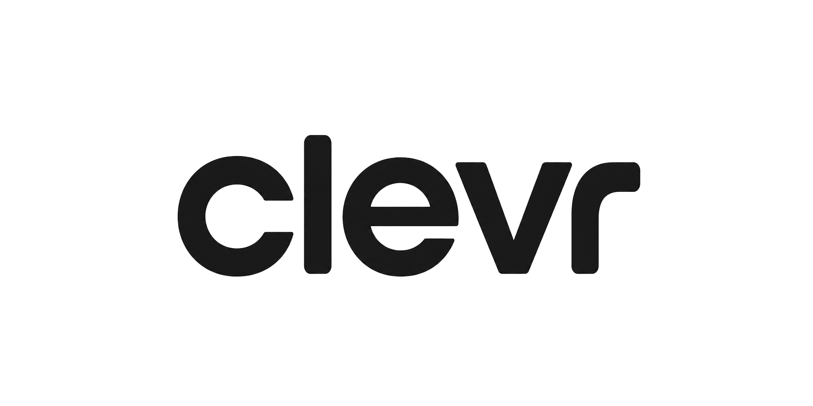

<div align="center">



**Tap to pay without the card networks.**
The merchant avoids the fee. You keep a share of it.

[**Live app →**](https://clevr-ten.vercel.app)

</div>

---

## Why

From **1 October 2026** the RBA bans surcharging on eftpos, Visa and Mastercard.
Merchants absorb card costs and can't use price to steer payments any more.
Australia already has the instant rails (NPP + PayID + PayTo). CLEVR is the
consumer product on top: pay bank-to-bank, split the avoided card fee at the
till.

Shopper sees "Pay $9.95 instead of $10.00". Merchant keeps most of what they
were losing to Visa. Money lands instantly, not T+1, with no chargebacks.

## How it works

1. **Scan** the merchant's QR at the counter (`/pay`).
2. **Confirm** the amount in your banking app — one tap after the first PayTo mandate.
3. **Keep the difference.** The green sheet sweeps in over the confirm screen, the route swaps behind it, and it sweeps off to reveal the receipt (`/p/[ref]/done`) with confetti + tick. One continuous horizontal motion across two routes.
4. **Track it.** Home and Insights show lifetime kept, weekly/monthly trends, per-merchant breakdown.

The whole loop works from a stranger's phone with zero signup for the first
payment.

**Two audiences, one waitlist.** The landing hero shows *Get CLEVR* (shopper);
scroll to the black "The card fee becomes your discount" band for *CLEVR for
business*. Both post to the same Supabase table, tagged by `audience`.

## Run it

```bash
npm install
npm run dev            # http://localhost:3000
```

Mobile only — the layout is a fixed 430px phone column. On desktop it just
centres.

**Live:** https://clevr-ten.vercel.app · **Waitlist QR:** `public/qr.png` (→ `/?open=waitlist`)

## Routes

| Path | Who | What |
|---|---|---|
| `/` | Public | Landing — hero, shopper waitlist, business band + business waitlist, QR |
| `/join` | Public | Sign in / sign up |
| `/app` · `/activity` · `/insights` · `/account` | Shopper | Home, receipts, analytics, profile |
| `/pay` → `/p/[ref]` → `/p/[ref]/done` | Shopper | Scan → confirm → cape-sweep → receipt |
| `/m` · `/m/activity` · `/m/payouts` · `/m/account` | Merchant | Till, activity, payouts, profile |
| `/m/[ref]` → `/m/[ref]/done` | Merchant | Live sale → paid confirmation (routes outside the tab-bar shell) |

## Stack

- **Next.js 16** (App Router, Turbopack) · **React 19** · **TypeScript**
- **Tailwind v4** — every token in [`app/globals.css`](app/globals.css)
- **Supabase** — waitlist storage (server action → REST insert)
- **Motion** (`motion/react`) — hero fade, dialog scale, two-phase cape-sweep success overlay (`SuccessBurst` — `phase="enter"` on confirm screen, navigates on `onCovered`, mounts as `phase="cover"` on receipt and sweeps off)
- **dotLottie** — confetti + tick lotties on the payment success screen
- **Vercel** — git-linked auto-deploy from `main`

## Configuration

Create `.env.local`:

```
SUPABASE_URL=https://<project>.supabase.co
SUPABASE_SERVICE_ROLE_KEY=<service_role_key>
RAIL=mock                       # or `up` for real Up Bank rail
UP_PAYID=merchant@up.com.au     # only when RAIL=up
UP_TOKEN=<token>                # only when RAIL=up
```

Mirror `SUPABASE_URL` and `SUPABASE_SERVICE_ROLE_KEY` in
**Vercel → Settings → Environment Variables** (Production + Preview).

Supabase schema:

```sql
create table waitlist (
  id bigint generated always as identity primary key,
  email text not null,
  audience text not null default 'shopper'
    check (audience in ('shopper', 'business')),
  created_at timestamptz not null default now(),
  unique (email, audience)
);
```

**One table, two lists.** The landing page has two buttons — Get CLEVR and Get
CLEVR for business — and both post the same form to the same row. `audience`
is what tells them apart, and the uniqueness is on the pair, so a shop owner
who also shops can be on both lists without either signup being swallowed as
a duplicate.

If the table predates the `audience` column, run:

```sql
alter table waitlist
  add column audience text not null default 'shopper'
    check (audience in ('shopper', 'business'));
alter table waitlist drop constraint waitlist_email_key;
alter table waitlist add constraint waitlist_email_audience_key
  unique (email, audience);
```

Until that runs, `joinWaitlist` retries the insert without `audience` when
PostgREST rejects the unknown column, so signups keep working and land
unlabelled rather than erroring.

The service-role key bypasses RLS but only ever runs server-side inside
`app/actions/waitlist.ts`, so it never reaches the browser.

## Design

Sun yellow (`#fff401`) is the page. Ink (`#000`) is every mark. Paper (`#fff`)
is the card and modal. No gradients, no shadows — elevation is a hairline
border.

Tailwind v4 only matches **literal** class names, so keep variants in `const`
maps. `` `rounded-${n}` `` renders unstyled and silently.

See [`DESIGN.md`](docs/DESIGN.md).

## Docs

| | |
|---|---|
| [BUSINESS.md](docs/BUSINESS.md) | The idea, model, income streams, competitors |
| [BRIEF.md](docs/BRIEF.md) | Hackathon theme, pillars, judges |
| [TECHNICAL.md](docs/TECHNICAL.md) | Architecture, rail interface, build order |
| [DESIGN.md](docs/DESIGN.md) | Tokens, primitives, the rules |
| [MENTOR_FEEDBACK.md](docs/MENTOR_FEEDBACK.md) | Notes from mentors |

## Scripts

```bash
npm run dev       # dev server (turbopack)
npm run build     # production build
npm run start     # serve the build
npm run lint      # eslint
```
