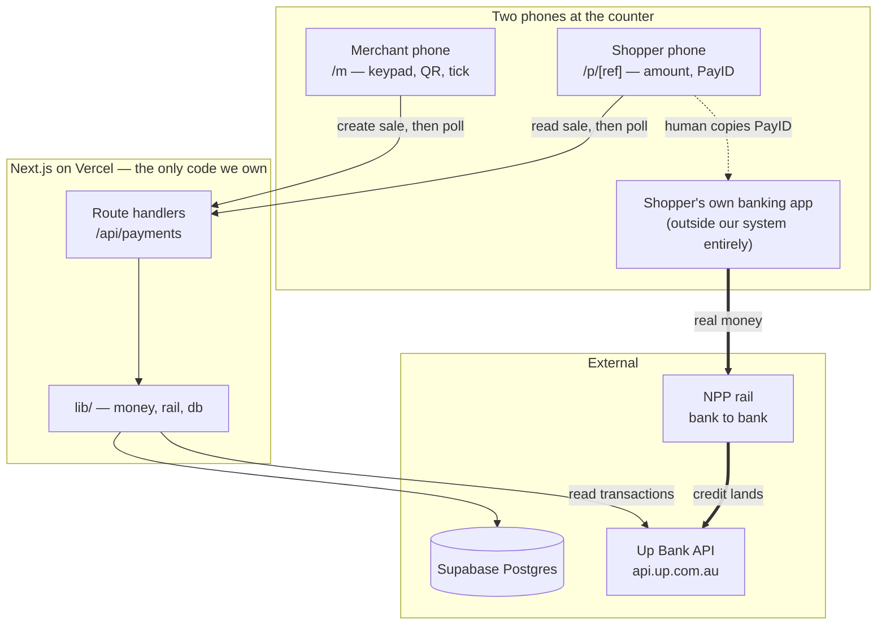
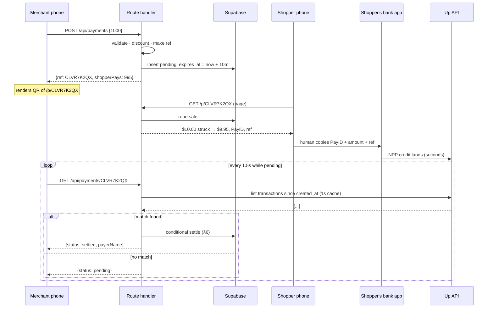
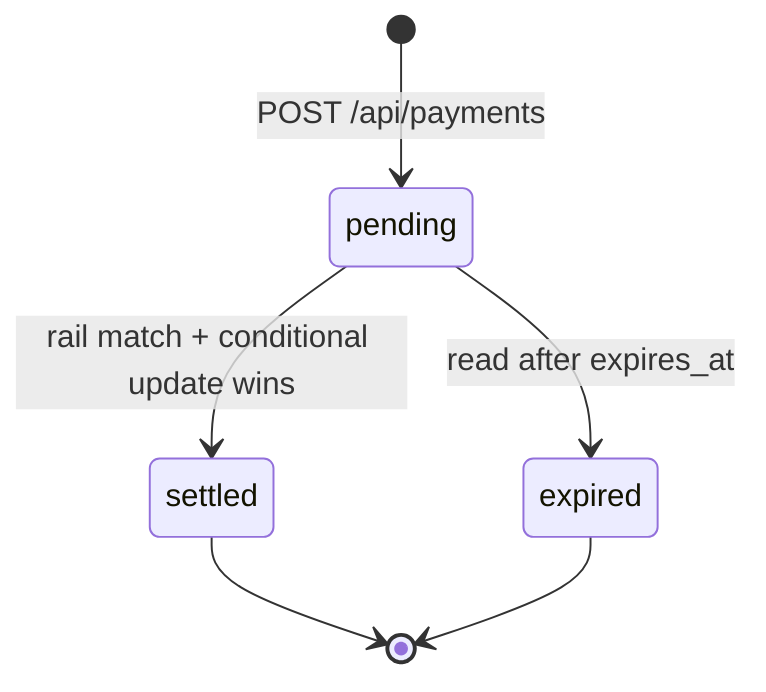

# CLEVR — Technical Plan

Hackathon build. Next.js 16 (App Router) + Supabase. One repo, one Vercel deploy.
Real money, real bank, real tick on stage.

---

## 1. The one hard problem

Everything else is CRUD. The demo lives or dies on this:

> A stranger pays $9.95 from their own banking app. How does our merchant screen
> know, within seconds, without us touching the money?

Options, honestly:

| Option | Real money | Latency | Onboarding | Verdict |
|---|---|---|---|---|
| Azupay / Monoova / Zepto webhook | yes | ~1s | days–weeks, KYC | **production answer**, not a weekend answer |
| Basiq / CDR open banking | yes | 5–60s | needs accreditation | blocked |
| Merchant taps "confirm" manually | yes | human | none | kills the magic |
| **Up Bank personal API** | **yes** | **~1–3s** | **minutes, self-serve token** | **demo answer** |

**Decision: Up Bank is the demo rail.** Up is an AU bank, receives PayID, and ships
a documented public API (`api.up.com.au`) with a transactions endpoint. Generate a
token, point a PayID at the account, done. Real dollars from a stranger's real
banking app, detected programmatically.

On stage this is a *strength*, not a hack: "we demoed on a real bank's API in 48
hours; production runs on a licensed NPP provider — same interface, one file."

---

## 2. System architecture

Two phones, one Next.js app, two external services. Nothing else.



The thick line is the only path money takes. It does not pass through us — that
is the architecture's single most important property and the answer to half the
Q&A (§13).

### Trust boundaries

Three secrets, all server-only. None may ever reach the browser:

| Secret | Lives in | Why it never ships to the client |
|---|---|---|
| `UP_TOKEN` | route handlers | Read access to a real bank account |
| `SUPABASE_SERVICE_KEY` | route handlers | Bypasses RLS; full table access |
| — | — | There is no third. The client holds nothing. |

**The browser never talks to Supabase.** No anon key, no client-side Supabase
import, no RLS policy authoring. Instead: **enable RLS on both tables and write no
policies at all.** RLS-on-with-no-policies denies everything to anon and
authenticated roles, while the service role bypasses RLS by design. So the DB is
closed by default and every access goes through a route handler we control.

That is one line of SQL per table doing the job an afternoon of policy-writing
would otherwise do, and it fails closed rather than open.

### Layers we are deliberately not having

No service layer, no repository pattern, no DI container, no API client wrapper,
no state manager. The whole app is **route handlers calling three pure-ish
modules**. At this size any additional layer is indirection with no payoff — and
a hackathon codebase that needs a diagram to find the database query is a
codebase nobody can fix at 2am the night before.

---

## 3. Repo layout

```
app/
  layout.tsx              mobile shell, fonts, tokens
  globals.css             every design token (DESIGN.md §3)
  m/
    page.tsx              keypad
    [ref]/page.tsx        QR + waiting → PAID
  p/
    [ref]/page.tsx        shopper page
  api/payments/
    route.ts              POST  create sale
    [ref]/route.ts        GET   status (and settles — see §6)
components/
  Button.tsx  Card.tsx  CopyField.tsx  Tick.tsx
lib/
  money.ts                pure arithmetic, zero imports
  money.test.ts           the one required test
  db.ts                   the only place a Supabase client is constructed
  ref.ts                  Crockford base32 reference codes
  rail.ts                 the Rail interface + impl selection
  rail/
    up.ts                 real money, real bank
    mock.ts               offline dev + stage fallback
supabase/
  schema.sql              tables, indexes, RLS. Run once, by hand.
```

### Dependency rule

One direction, no cycles. Enforced by review, not by tooling — a lint rule for
four modules is ceremony.

```
app/**  →  components/**  →  lib/**
app/**  →  lib/**
lib/rail/*  →  lib/rail.ts   (types only)
lib/money.ts  →  nothing
```

`lib/money.ts` importing nothing is load-bearing: it makes the money test a plain
`node:test` file with no mocks, no DB, no fixtures. That is why the one test we
require is also the one test that's trivial to write.

### Dependencies

Four, each justified:

| Package | Why not hand-rolled |
|---|---|
| `@supabase/supabase-js` | Postgres client |
| `qrcode` | QR encoding is Reed–Solomon error correction. Hand-rolling it is not lazy, it's insane. Server-side, emits an SVG string, ships zero client JS. |
| `@hugeicons/core-free-icons` | Solid, clean, unified free vector icons |
| `@hugeicons/react` | React component wrapper for Hugeicons |

No zod, no form library, no fetch wrapper, no date library. Validation is three
lines (§8) and the only date math is `Date.now()`.

---

## 4. Contracts

The types are the architecture. Everything else is plumbing.

```ts
// lib/money.ts — pure, no imports
export type Cents = number;

export function discountCents(amount: Cents, bps: number): Cents;
export function shopperPays(amount: Cents, bps: number): Cents;

// lib/rail.ts
export type PaymentRequest = {
  payid: string;
  amountCents: Cents;
  ref: string;
};

export type Settlement = {
  txnId: string;        // the rail's own id — our idempotency key
  settledAt: string;    // ISO
  payerName: string | null;
  matchedBy: "ref" | "amount";
};

export interface Rail {
  createRequest(amountCents: Cents, ref: string): Promise<PaymentRequest>;
  findSettled(q: {
    ref: string;
    amountCents: Cents;   // what the shopper actually pays, post-discount
    since: string;        // sale created_at
    until: string;        // now, or expires_at — whichever is earlier
  }): Promise<Settlement | null>;
}
```

`matchedBy` exists purely so the logs can tell you *why* something ticked. On
stage, "matched on amount because CBA stripped the reference" is a diagnosis;
"it ticked" is a shrug.

### HTTP contracts

```
POST /api/payments
  →  { amountCents: number }
  ←  201 { ref, payid, amountCents, discountCents, shopperPaysCents, expiresAt }
  ←  400 { error }                       invalid amount

GET /api/payments/[ref]
  ←  200 { status, amountCents, shopperPaysCents, payid, expiresAt,
           payerName?, settledAt? }
  ←  404 { error }                       unknown ref
```

One endpoint pair. No PATCH, no DELETE — a sale is created, then observed. It is
never edited.

---

## 5. Request lifecycle



The shopper page polls the same endpoint so it can show its own confirmation.
Both pollers share the 1s transaction cache (§7), so two open pages cost the same
Up quota as one.

---

## 6. Payment state machine, and the settle race



Three states, two transitions, both irreversible. `settled` and `expired` are
terminal — nothing in the system ever moves a payment backwards.

### The race

`GET /api/payments/[ref]` mutates. Merchant and shopper both poll it every 1.5s,
so **concurrent settle attempts for the same sale are the normal case, not an edge
case.** Two guards, both in the database, because app-level checks lose races:

```sql
-- Guard 1: only one caller can transition a given sale out of pending.
update payments
   set status = 'settled', settled_txn_id = $1, settled_at = $2, payer_name = $3
 where ref = $4
   and status = 'pending'
returning *;
-- zero rows returned = someone else already settled it. Re-read and return theirs.

-- Guard 2: one bank transaction can never settle two different sales.
-- unique index on settled_txn_id → 23505 on conflict, which we treat as
-- "already claimed", not as an error.
```

Guard 1 makes the endpoint idempotent. Guard 2 makes the amount-fallback (§9)
safe to be wrong occasionally — a mismatched claim can lose, but it can never
double-credit.

### Expiry is lazy

`expires_at = created_at + 10 minutes`. No cron, no scheduled function, no
background worker. A stale sale flips to `expired` the next time anyone reads it,
and unread stale sales don't matter because nothing ever reads them.

Expiry is not tidiness — it is a **correctness requirement** for the amount
fallback. See §9.

---

## 7. Rail implementations

### `rail/up.ts`

`GET /transactions?filter[since]=…&filter[until]=…`, then scan for an incoming
credit. Notes that matter:

- **Only credits.** Up returns debits in the same feed; a $9.95 coffee the account
  *spent* must never settle a $9.95 sale. Filter on positive amount, always.
- **1-second shared cache.** A module-level `{ fetchedAt, promise }` dedupes
  concurrent polls, so N open pages cost one Up call per second rather than N.
  Per-lambda-instance on Vercel, which is fine — a hackathon runs warm on one.
- **Timeout every call** at 3s (`AbortSignal.timeout`). A hung fetch on a poll
  loop is a screen that silently stops updating, which looks exactly like a
  product that doesn't work.

`ponytail: 1s in-memory cache, per instance. Move to a webhook + Supabase Realtime when a merchant runs more than one till, or when poll volume hits Up's rate limit.`

### `rail/mock.ts`

Settles any pending sale 4 seconds after creation. This is the offline dev loop
*and* the stage fallback, which is why it is written first (§11 step 2) rather
than last.

### Selection

`RAIL=up|mock`, read once at module load. Defaults to `mock` — so a missing env
var degrades to a working demo rather than a crash, and a forgotten `UP_TOKEN` in
CI can never accidentally hit a real bank.

---

## 8. Input validation

The trust boundary is `POST /api/payments`. The body comes from a browser, so it
comes from an attacker.

```ts
const n = body?.amountCents;
if (!Number.isSafeInteger(n) || n < 1 || n > 100_000) return bad("amount");
```

Integer (no floats near money), positive (no negative sales), capped at $1,000
(this is a coffee stall; a $2M QR on our merchant's PayID is somebody else's bad
day). Three lines, no schema library.

`ref` is generated server-side and never accepted from input. `discount_bps` comes
from the merchant row, never the request — otherwise a crafted POST sets its own
discount to 100%.

---

## 9. Money math

We never hold funds. Shopper pays the merchant's account directly. CLEVR bills the
merchant monthly SaaS — the full spread passes through to the shopper. This is
also the cleanest possible answer to "so where does the money sit?"

On a $10 sale, `discount_bps = 50`:

```
amount_cents          1000   what the merchant keys in
discount_cents           5   max(1, round(amount * bps / 10000))
shopper_pays           995
merchant_receives      995   direct, instant, final

vs card @ 1.40%
merchant_receives      986   T+1, chargeable back
```

Merchant is **+9c and a day earlier**. Shopper is **+5c**. Nobody lost.

This is the only non-trivial logic in the build and it is money logic, so it gets
`lib/money.test.ts` — asserts on $0.01, $10.00 and $999.99, that `discountCents`
never exceeds `amount`, and that it never rounds to zero.

### Matching a payment to a sale

Reference first, amount as the fallback:

1. Each sale gets `ref` = `CLVR` + 6 chars Crockford base32 (`CLVR7K2QX`). Short
   enough to survive bank reference fields that truncate around 18 chars, and the
   alphabet already excludes I, L, O and U — which is also why it's safe to render
   in the shopper's monospace copy field (DESIGN.md §1).
2. Scan credits in `[created_at, min(now, expires_at)]` for one whose description
   contains the ref.
3. **Fallback:** no ref match → accept a credit whose amount exactly equals
   `shopper_pays_cents`, **provided it is the only unexpired pending sale at that
   amount.** Several AU bank apps drop the description field entirely; without
   this the demo dies on the wrong bank.
4. Never claim a transaction another sale already holds (Guard 2, §6).

**Why expiry is load-bearing.** Without a bounded window, a forgotten pending $9.95
from an hour ago could claim the credit intended for a fresh $9.95 sale — the
right amount arriving at the wrong sale. The 10-minute TTL plus the
only-one-pending-at-this-amount condition is what makes rule 3 safe. Rule 3 is not
optional and neither is its guard: together they are the difference between "works
in testing" and "works when a stranger uses NAB on stage."

---

## 10. Data model

Two tables. Resisting the urge to add more.

```sql
create table merchants (
  id           uuid primary key default gen_random_uuid(),
  name         text not null,
  payid        text not null,          -- the Up PayID funds land on
  discount_bps int  not null default 50
);

create table payments (
  id             uuid primary key default gen_random_uuid(),
  merchant_id    uuid not null references merchants(id),
  ref            text not null unique,
  amount_cents   int  not null,
  discount_cents int  not null,
  status         text not null default 'pending',   -- pending|settled|expired
  settled_txn_id text unique,          -- null until settled; unique = no double-claim
  payer_name     text,
  shopper_cookie text,                 -- anonymous, for the savings counter (§12)
  first_viewed_at timestamptz,         -- when shopper first opened the payment page
  created_at     timestamptz not null default now(),
  expires_at     timestamptz not null,
  settled_at     timestamptz
);

-- the only two queries that aren't by primary key
create index on payments (status, expires_at);        -- fallback sibling check
create index on payments (shopper_cookie, settled_at); -- savings counter

-- closed by default: RLS on, zero policies. Service role bypasses. §2
alter table merchants enable row level security;
alter table payments  enable row level security;
```

Not building: `shoppers`, `mandates`, `devices`, `merchant_users`. PayTo, the
soundbox and the fast lane are slides. A table for a slide is a table for nobody.

Auth: none. One seeded merchant row, merchant UI on an unguessable path. A 48h
demo with no funds custody and no PII — magic links are 40 minutes better spent on
the shopper page.

`ponytail: no merchant auth, merchant_id resolved from a single seeded row. Add Supabase magic-link the day a second merchant exists.`

---

## 11. Routes

```
/m                        merchant keypad → POST /api/payments
/m/[ref]                  QR + live amount + tick (polls)
/p/[ref]                  shopper page: "Pay $9.95 instead of $10.00"
/api/payments       POST  create sale
/api/payments/[ref]  GET  status; asks the rail if still pending
```

QR encodes the absolute URL of `/p/[ref]`, generated server-side by `qrcode` as an
inline SVG. Shopper's normal camera opens it — no app, no signup, which is the
whole point of the slow lane.

AU banks have no universal PayID intent scheme, so there is no reliable deep link
into a banking app. Accept it: giant copyable PayID, giant copyable amount, giant
copyable ref, one line of instruction. Big copy targets beat a broken deep link.

### One deliberate REST violation

`GET /api/payments/[ref]` has a side effect: it settles. That is not an oversight
and should not be "fixed" later without replacing it — it is what buys us no cron,
no webhook endpoint, no public URL requirement and no retry logic. The conditional
update (§6) makes it idempotent, which is the property that actually matters.

The honest alternative is a webhook, and it costs a public URL, signature
verification and a retry story to save about one second on a screen someone is
already staring at.

---

## 12. Configuration

```
CLEVR_KEY=…                     server only, gates dev door access
RAIL=up|mock                    default: mock
UP_TOKEN=up:yeah:…              server only, never NEXT_PUBLIC_
UP_PAYID=you@example.com        what the shopper pays
SUPABASE_URL=…
SUPABASE_SERVICE_KEY=…          server only, bypasses RLS
NEXT_PUBLIC_BASE_URL=…          only public var; needed to build QR URLs
```

Exactly one `NEXT_PUBLIC_` variable exists, and it is a URL. If a second one ever
appears in a diff, that is the review flag for a leaked secret.

---

## 13. Failure modes

| Failure | Behaviour | Why this and not something cleverer |
|---|---|---|
| Up API down / times out | Poll returns `pending`, screen keeps waiting | A stuck spinner beats a false tick. Never fabricate a settlement. |
| Up rate limit hit | 1s shared cache keeps us far under it | See §7 |
| Supabase down | 500 on create; existing QR pages keep polling | Nothing to do about it in 48h and saying so is better than a fake queue |
| Shopper pays wrong amount | Stays `pending` | "It only ticks on an exact match" is a feature — say it out loud |
| Shopper pays after expiry | Stays `expired`, no auto-settle | Refund by hand; correctness beats convenience on money |
| Two pages poll at once | Conditional update, one winner | §6 |
| Venue wifi dies | `RAIL=mock` | §14 |

### Observability

One structured log line per poll that finds anything, and one per settle:

```
settle ref=CLVR7K2QX matchedBy=amount txn=… candidates=3 ms=412
```

`console.log`, captured by Vercel. This is the entire observability story and it
is sufficient, because the only question anyone will ask on stage is *"why hasn't
it ticked yet"* — and `candidates=0` versus `candidates=3 matchedBy=none` answers
it in one glance.

---

## 14. Theme fit — the shopper savings counter

The hackathon theme is consumer financial freedom, not merchant fees. CLEVR as
written in [BUSINESS.md](BUSINESS.md) is a merchant-economics pitch, and that is a
real risk with these judges ([BRIEF.md](BRIEF.md)).

Cheapest fix that is also genuinely good product: a **savings counter** on the
shopper page. A cookie holds an anonymous id, `payments.shopper_cookie` records it,
the page shows what they've earned back.

Show a total *and* the rate it implies — the rate is what makes this an "Achieve"
tool rather than a receipt:

```
"$2.35 back · about $60/year at this pace"

rate = sum(discount_cents) / max(days_active, 1) * 365
```

Only render the projection when `count >= 2`. Extrapolating an annual figure from
one $1 payment produces a number that is both absurd and instantly discreditable
on stage.

~30 lines. It turns the demo from "merchants save money" into "you get paid to
spend your own money, from your own account, with no card in between" — the theme,
in the theme's own words. Highest ratio of pitch value to code in the repo.

`ponytail: naive linear extrapolation from first payment. Fine for a demo counter, not a forecast. Needs a rolling window once there's more than a weekend of data.`

---

## 15. Build order, with cut lines

Ship in this order. Everything above the cut line must work.

1. `supabase/schema.sql` — tables, indexes, RLS on. Seed one merchant.
2. `lib/money.ts` + `lib/money.test.ts` + `lib/ref.ts` — pure, testable, no I/O
3. `lib/rail.ts` + `rail/mock.ts` — the full loop with no bank in sight
4. `POST /api/payments` + `GET /api/payments/[ref]` incl. the conditional settle
5. `/m` keypad → `/m/[ref]` QR + polling + tick
6. `/p/[ref]` shopper page — the correction gesture, PayID, copy fields
7. `rail/up.ts` — flip `RAIL=up`, send yourself a real $1
8. **— CUT LINE. Steps 1–7 are the demo. —**
9. Savings counter (do this one; §14)
10. Merchant day total + last 5 payments
11. Sound on tick (browser `Audio`; the soundbox is a 3D-printed prop with a phone
    inside it, and that is fine)

Steps 1–4 have no UI and step 3 has no bank — that ordering is deliberate. The
riskiest integration (step 7) lands against a loop that already provably works, so
a failure there is isolated to one file instead of ambiguous across five.

Not building, on purpose: PayTo mandates, fast lane, refunds, merchant analytics,
lending, stablecoins, soundbox firmware. Each is one line on a roadmap slide.

---

## 16. Demo-day risk register

| Risk | Mitigation |
|---|---|
| Venue wifi dies | `RAIL=mock` env flip + redeploy (~40s). Faster fallback: `npm run dev` on the laptop with `RAIL=mock`, presented locally. Rehearse both. |
| Stranger's bank strips the reference | Amount-match fallback (§9.3). Test with 2+ real banks before stage. |
| Stranger's bank is slow on NPP | Keep talking; the poll will land. Test the specific bank beforehand if you can. |
| `UP_TOKEN` leaks into the client bundle | Server-only, never `NEXT_PUBLIC_`. Grep the built bundle for `up:yeah` before deploy. |
| Someone pays the wrong amount | Stays `pending`. "It only ticks on an exact match" is a feature. |
| Nobody scans anything | Have a second phone with the page already open. |

---

## 17. Questions the Swyftx CTO will ask

Have the one-sentence answer ready:

- *Where does the money sit?* Nowhere near us. Shopper account → merchant account
  over NPP. We bill SaaS monthly.
- *What's your licence exposure?* None. Production sits on a licensed NPP provider
  who does merchant KYC. We're the product layer.
- *What happens on a dispute?* No chargebacks exist on NPP. Merchant pushes a
  refund over the same rail in seconds. We launch on low-value in-person purchases
  where that's a feature, not a gap.
- *That's a bank's personal API, not a payments rail.* Correct — it's how we got
  real money moving in 48 hours. Production is Azupay/Monoova, one file behind the
  same interface (§4).
- *How do you know the right payment settled the right sale?* Reference code first,
  exact-amount fallback second, and two database-level guards so a transaction can
  never settle twice or settle the wrong sale (§6).
